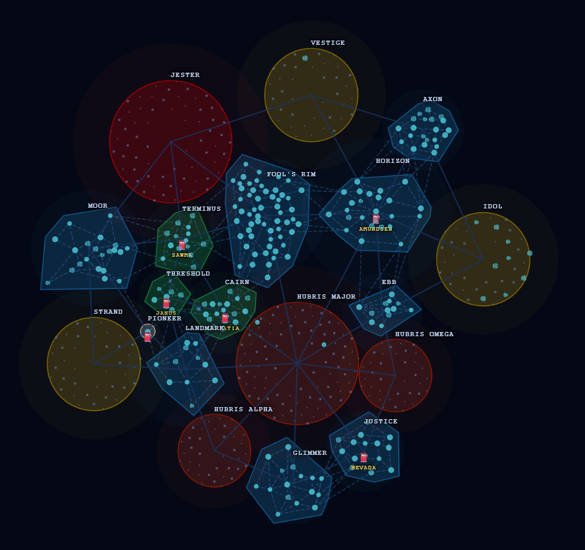

# SpaceCraft Galaxy Map

An interactive galaxy map for the game **SpaceCraft**, built with [Leaflet.js](https://leafletjs.com/) and Vite.

**[View the live map → http://the1killer.github.io/SpaceCraftMap/](http://the1killer.github.io/SpaceCraftMap/)**

---

---

## Features

- **Interactive galaxy map** — pan, zoom, and explore the full game universe
- **Sector regions** — colour-coded by difficulty zone (Tutorial, Early Game, Mid Game, Hard, Ultra-Danger)
- **Hyperspace lanes** — system-level and sector-level connections visualized as lines
- **System details** — click any system to see its name, sector, coordinates, and planet resources
- **Sector popups** — access requirements, linked sectors, and available loot materials
- **Polygon sectors** — select sectors rendered as accurate shaped polygons rather than circles

## Zone Legend

| Colour | Zone |
|--------|------|
| 🟩 Green | Early Game |
| 🟦 Blue | Mid Game |
| 🟨 Yellow | Hard |
| 🟥 Light Red | Obstacle |
| ⬛ Dark Red | Ultra-Danger |
| ⬜ White/Blue | Tutorial |

## Planned Features - TODO

- [ ] Region selector (NA/EU)
- [ ] More Sector Data
- [ ] More Warp Lines
- [ ] Hazard markers

## Hopes & Dreams

- [ ] Warp Calculator
- [ ] Planet Data

## Tech Stack

- [Leaflet 1.9](https://leafletjs.com/) — map rendering (Simple CRS for game coords)
- Galaxy data extracted from game files via Python tooling
